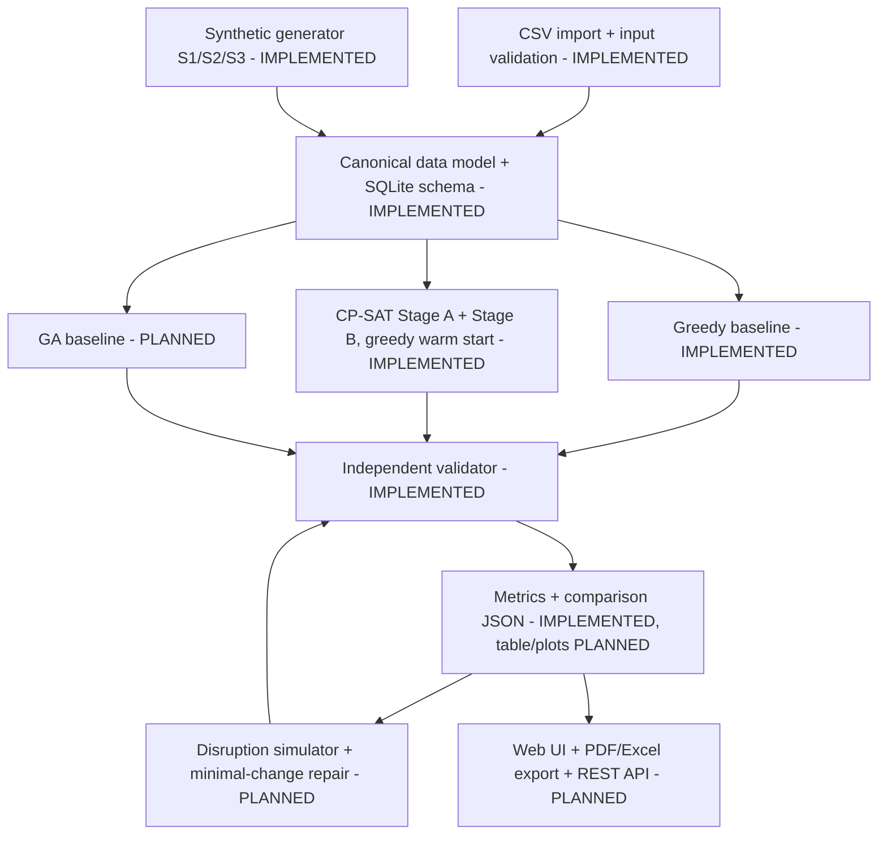
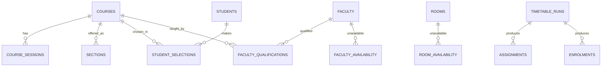

# Architecture (status labels match the code)

```mermaid
flowchart TD
    A[CSV import + input validation - IMPLEMENTED] --> B[Canonical data model + SQLite schema - IMPLEMENTED]
    G[Synthetic generator S1/S2/S3 - IMPLEMENTED] --> B
    B --> E1[Greedy baseline - IMPLEMENTED]
    B --> E3[CP-SAT Stage A + Stage B, greedy warm start - IMPLEMENTED]
    B --> E2[GA baseline - PLANNED]
    E1 --> F[Independent validator - IMPLEMENTED]
    E3 --> F
    E2 --> F
    F --> M[Metrics + comparison JSON - IMPLEMENTED, table/plots PLANNED]
    M --> J[Disruption simulator + minimal-change repair - PLANNED]
    J --> F
    M --> H[Web UI + PDF/Excel export + REST API - PLANNED]
```

```mermaid
erDiagram
    COURSES ||--o{ COURSE_SESSIONS : has
    COURSES ||--o{ SECTIONS : offered_as
    COURSES ||--o{ STUDENT_SELECTIONS : chosen_in
    STUDENTS ||--o{ STUDENT_SELECTIONS : makes
    FACULTY ||--o{ FACULTY_QUALIFICATIONS : qualified
    COURSES ||--o{ FACULTY_QUALIFICATIONS : taught_by
    FACULTY ||--o{ FACULTY_AVAILABILITY : unavailable
    ROOMS ||--o{ ROOM_AVAILABILITY : unavailable
    TIMETABLE_RUNS ||--o{ ASSIGNMENTS : produces
    TIMETABLE_RUNS ||--o{ ENROLMENTS : produces
```
